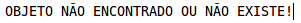
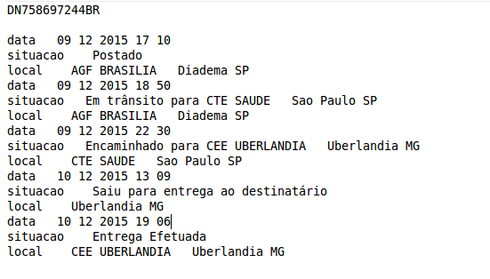

# ws-consultar-objeto-correios-java

<h5>Mensagem no console do eclipse.</h5>

==========================================================

==================================================

###Objetivo

Esse projeto tem por finalidade, criar um serviço via JAVA, para que possa ser consumido em seu retorno as informações de um WebService(WS) para buscar situação da mercadoria pelo objeto do correios(postado/entregue/extraviado/longe de casa ;D). Conforme os prints acima. 
Nesse projeto utilizo o retorno do WS criado pelo @talesluna, que formatou os dados para retornarem em JSON e XML. Utilizei retorno em JSON. 
(https://github.com/talesluna/Rastro)

###Pré-requisito para rodar o projeto			 
  -JDK 7 
  -Eclipse 
  -Apache-Maven-3+
 
###Tecnologias utilizadas			 
  JAVA EE, JSON, MAVEN, JERSEY - API WS, Google Gson (Parser)
		 
###Como executar?
Importar o projeto no eclipse.
Botão direito do mouse no Project Explore > Import > Maven > Existing Maven Project > caminho do download feito.
Abrir a classe App.java e executar método main.  
Abrir a classe AppTest.java para efetuar o teste de conexão com um número de objeto válido.  
Let's be happy :D	
		 

			

